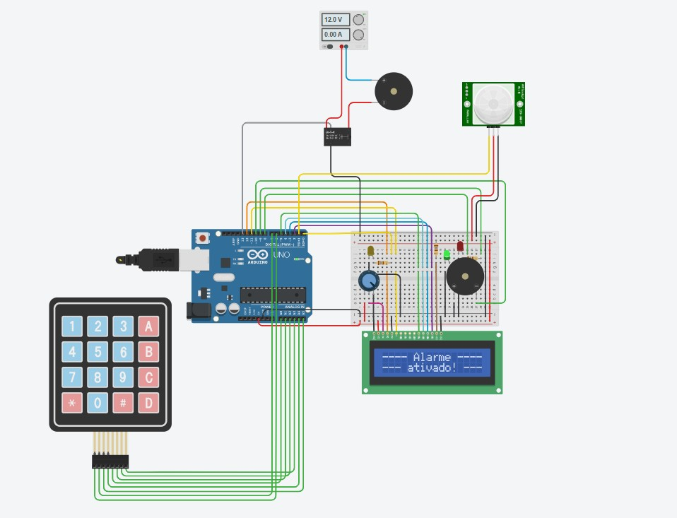

# 🔐 Sistema de Alarme com Senha (Arduino)

## 📌 Descrição do Projeto

Este projeto implementa um **sistema de alarme com autenticação por senha utilizando Arduino**. O sistema utiliza um **teclado matricial (keypad)** para que o usuário possa inserir uma senha numérica.

Quando o sistema está ativado, sensores monitoram o ambiente. Caso movimento seja detectado sem que a senha correta tenha sido inserida, o **alarme sonoro é ativado**.

O projeto também utiliza um **display LCD** para exibir mensagens ao usuário, como instruções para digitar a senha, confirmação de acesso ou alertas de segurança.

---

## ⚙️ Componentes Utilizados

* 1 × Arduino Uno R3
* 1 × Keypad matricial 4x4
* 1 × Display LCD 16x2
* 1 × Sensor de movimento PIR
* 2 × Buzzers
* 3 × LEDs indicadores
* 1 × Potenciômetro (controle de contraste do LCD)
* Resistores (220Ω / 10kΩ)
* 1 × Protoboard
* Jumpers (fios de conexão)

---

## 🔌 Principais Conexões

### Keypad 4x4

O teclado matricial é conectado a múltiplos **pinos digitais do Arduino**, permitindo detectar qual tecla foi pressionada.

### Display LCD 16x2

O display é utilizado para mostrar mensagens como:

* Inserir senha
* Acesso liberado
* Alarme ativado
* Movimento detectado

O potenciômetro é usado para **ajustar o contraste do display**.

### Sensor PIR

Responsável por **detectar movimento no ambiente**.

Conexões:

* VCC → 5V do Arduino
* GND → GND
* OUT → pino digital do Arduino

### Buzzers

Utilizados para emitir alertas sonoros quando:

* senha incorreta é digitada
* movimento é detectado
* o alarme é ativado

### LEDs Indicadores

Os LEDs servem como indicadores visuais de status do sistema, por exemplo:

* sistema armado
* acesso permitido
* alerta ativo

---

## 🔄 Funcionamento do Sistema

1. O sistema inicializa e solicita a **senha no display LCD**.
2. O usuário digita a senha no **keypad 4x4**.
3. O Arduino verifica se a senha digitada é válida.

### Se a senha estiver correta

* O acesso é liberado
* O alarme é desativado
* O display mostra confirmação

### Se a senha estiver incorreta

* Um alerta sonoro pode ser emitido
* O sistema continua bloqueado

### Quando o sistema está armado

* O **sensor PIR monitora o ambiente**
* Caso movimento seja detectado:

  * o **buzzer é ativado**
  * LEDs indicam estado de alerta
  * o display informa a detecção

---

## 🎯 Objetivo Educacional

Este projeto foi desenvolvido para praticar conceitos importantes de **sistemas embarcados**, incluindo:

* leitura de **teclado matricial**
* autenticação por **senha**
* uso de **display LCD**
* integração de **sensores e atuadores**
* desenvolvimento de **lógica de segurança em microcontroladores**

---

## 🚀 Possíveis Melhorias

Algumas evoluções possíveis para o projeto:

* adicionar **módulo RFID para autenticação**
* integrar **WiFi (ESP8266 ou ESP32)** para enviar notificações
* implementar **registro de tentativas de acesso**
* adicionar **controle por aplicativo mobile**
* incluir **bateria de backup**
